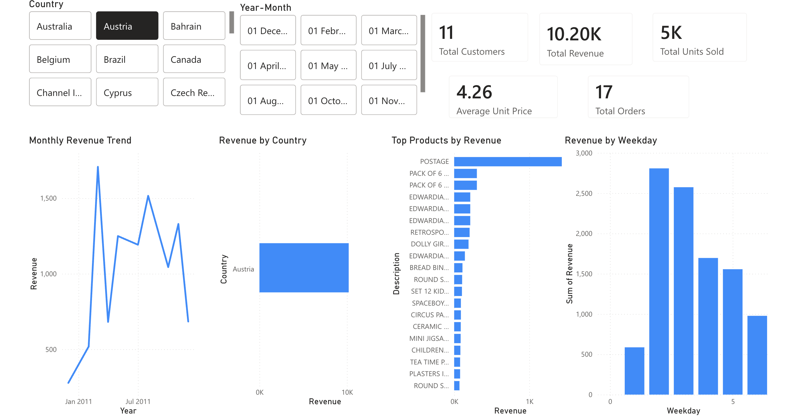
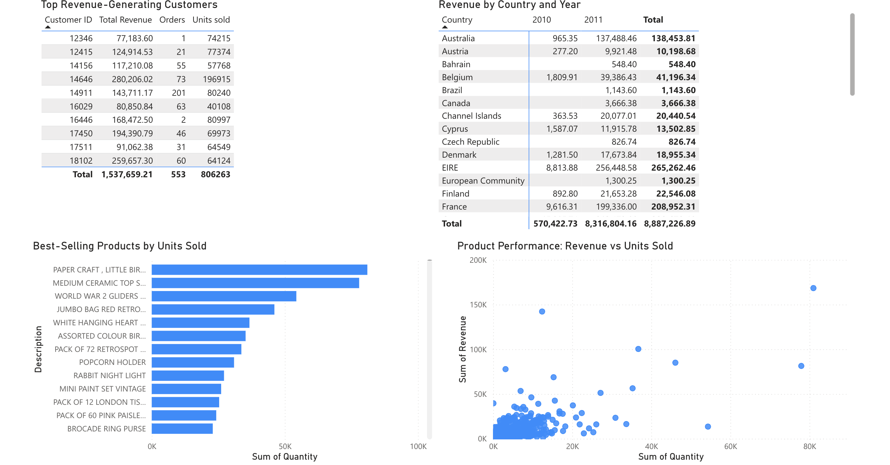
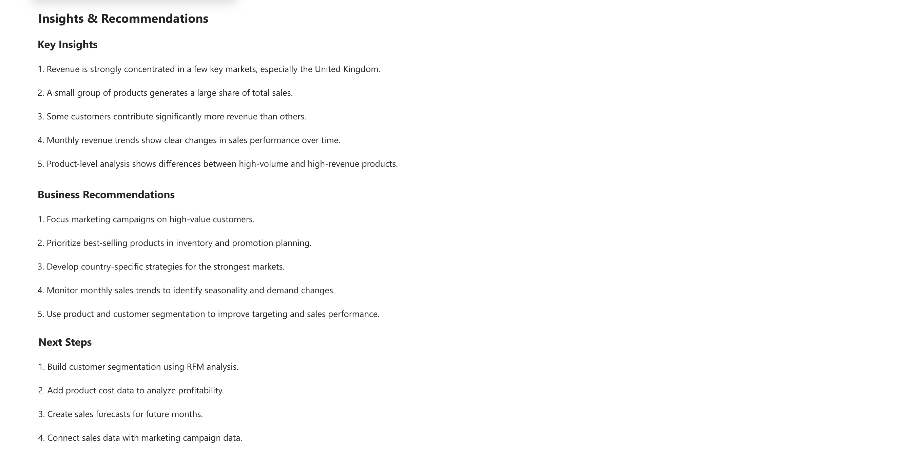

# Online Retail Sales Analysis

## Project Overview

This project analyzes online retail transaction data using Databricks, PySpark, SQL and Power BI. The goal is to understand sales performance, customer behavior, product performance and country-level revenue patterns.

The project demonstrates an end-to-end data analytics workflow, from data cleaning and transformation to SQL-based analysis and dashboard reporting.

## Business Question

How can online retail transaction data be used to identify sales trends, high-value customers, best-performing products and business growth opportunities?

## Tools Used

- Databricks
- PySpark
- SQL
- Delta tables
- Power BI
- GitHub

## Dataset

The dataset contains online retail transaction data, including:

- Invoice number
- Product code
- Product description
- Quantity
- Invoice date
- Unit price
- Customer ID
- Country

A new business variable was created:

```text
Revenue = Quantity × Price
```

Additional time-based variables were also created, including year, month, year-month and weekday.

## Project Workflow

1. Loaded the raw online retail dataset into Databricks
2. Reviewed the data structure and checked data quality
3. Cleaned and transformed the data using PySpark
4. Converted numeric and date columns into correct formats
5. Removed missing customer IDs and invalid transactions
6. Created revenue and time-based variables
7. Saved the cleaned dataset as a Delta table
8. Used SQL queries to analyze sales, customers, products and countries
9. Exported the cleaned dataset for Power BI
10. Built a Power BI dashboard
11. Summarized key insights and business recommendations

## Key Analyses

The analysis focused on the following areas:

- Total revenue
- Total orders
- Total customers
- Total units sold
- Average order value
- Monthly revenue trends
- Revenue by country
- Best-selling products
- Top revenue-generating customers
- Product performance by revenue and units sold
- Revenue patterns by weekday

## Key Insights

- Revenue was strongly concentrated in a few key markets, especially the United Kingdom.
- A small group of products generated a large share of total sales.
- Some customers contributed significantly more revenue than others.
- Monthly revenue trends showed clear changes in sales performance over time.
- Product-level analysis showed differences between high-volume and high-revenue products.
- Country-level analysis showed differences in market size and average order value.

## Business Recommendations

- Focus marketing campaigns on high-value customers.
- Prioritize best-selling products in inventory and promotion planning.
- Develop country-specific strategies for the strongest markets.
- Monitor monthly sales trends to identify seasonality and demand changes.
- Use product and customer segmentation to improve targeting and sales performance.
- Analyze product profitability by adding cost data in future analysis.

## Dashboard Preview

### Sales Overview



### Customer & Product Performance



### Insights & Recommendations



## Repository Structure

```text
online-retail-sales-analysis/
├── README.md
├── notebooks/
│   └── 02_online_retail_sales_analysis.ipynb
├── images/
│   ├── Page1,P2.png
│   ├── Page2,P2.png
│   └── Page3,P2.png
└── data/
    └── online_retail_cleaned_sample.csv
```

## Files

- `notebooks/` contains the Databricks notebook used for data cleaning, transformation and SQL analysis.
- `images/` contains screenshots of the Power BI dashboard.
- `data/` contains a cleaned sample dataset used for reporting and portfolio demonstration.

## Next Steps

Possible future improvements:

- Build customer segmentation using RFM analysis
- Add product cost data to analyze profitability
- Create sales forecasts for future months
- Connect sales data with marketing campaign data
- Add customer lifetime value analysis

## Project Summary

This project shows how online retail transaction data can be used to analyze sales performance, customer value, product performance and country-level business opportunities. The workflow combines data engineering, SQL analysis, dashboard reporting and business interpretation.
